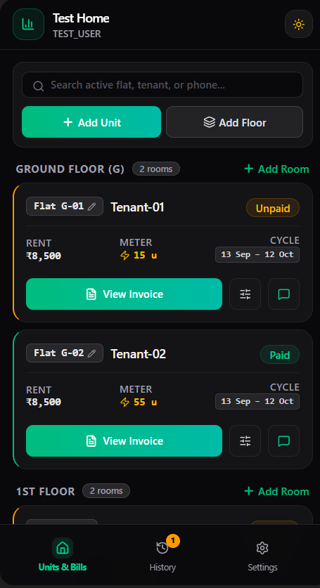
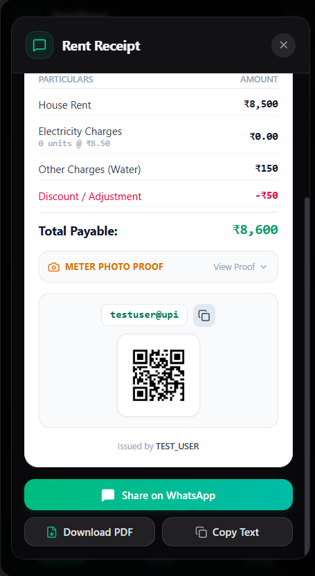
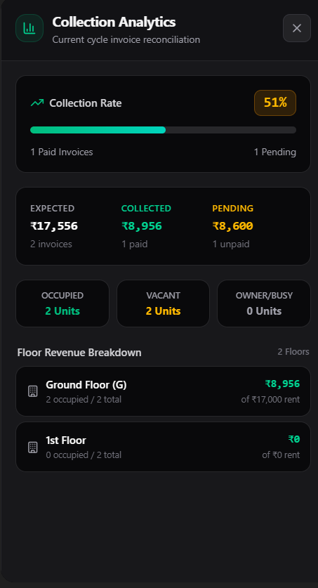
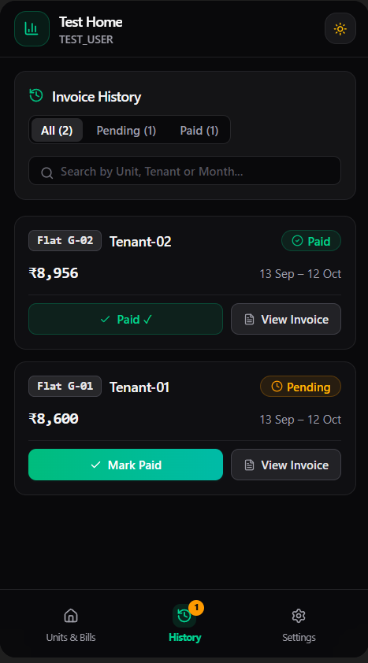
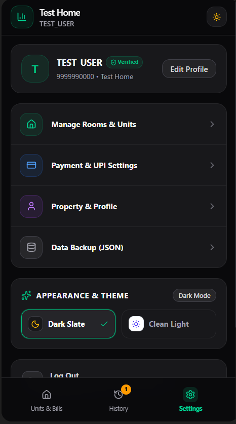

# RentBook PRO 🏢⚡

> A smart rental and electricity diary built for modern landlords to track rooms, automate billing cycles, calculate meter readings, and share digital receipts with embedded UPI QR codes.

---

## 📱 App Previews

| Units & Bills Dashboard | Digital Receipt & UPI QR |
| :---: | :---: |
|  |  |

| Collection Analytics Drawer | Invoice Payment History |
| :---: | :---: |
|  |  |

| Settings & Profile (Dark Slate) | Appearance (Clean Light) |
| :---: | :---: |
|  |  |

---

## ⚡ Core Features

* **Multi-Floor & Unit Management:** Add custom floors, organize rooms/flats, assign tenants, and monitor occupancy status (Occupied vs. Vacant) at a glance.
* **Smart Electricity Billing:** Track previous and current meter readings with configurable per-unit electricity rates and photo meter proof.
* **Instant Digital Receipts:** Generate itemized rent receipts with direct UPI QR codes, instant WhatsApp dispatch, PDF download, and clipboard copy.
* **Collection Analytics:** Real-time reconciliation dashboard showing collection rate percentages, collected vs. pending amounts, and per-floor revenue breakdowns.
* **Billing History Ledger:** Filter invoices by Paid or Pending status, search by tenant name or room number, and mark payments with one tap.
* **Dual Theme Engine:** Seamless switching between Dark Slate and Clean Light UI.
* **Cloud Sync & Data Safety:** Supabase backend integration with JSON backup export options.

---

## 🛠️ Tech Stack

| Layer | Technology |
| :--- | :--- |
| **Frontend Framework** | React 19 + TypeScript |
| **Build Tool & Bundler** | Vite |
| **Styling & Design** | Tailwind CSS |
| **Icons** | Lucide React |
| **Database & Auth** | Supabase (PostgreSQL + Auth) |
| **PDF Generation** | jsPDF / Canvas |
| **Deployment Target** | Vercel |

---

